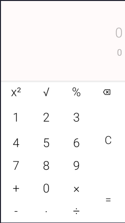

# Kotlin Calculator Basic App

---

In this project, i created an calculator basic with Kotlin language of programming for Android and other platforms

### How to open

1.  Have Android Studio in your computer 

2. Open Android Studio

3. Go to tool/archive/project/SELECT_YOUR_BUILD_GRANDLE

4. Done

###### Program used  for markdown text
